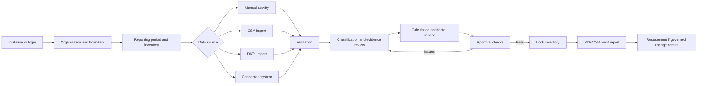

# User flows

## Primary end-to-end journey

## Screen map and completion paths

| Screen | User action | Required completion/exit |
|---|---|---|
| Login / invitation / recovery | Establish identity | Dashboard or actionable error/recovery |
| Dashboard | See status and priorities | Open organisation, inventory, review or report |
| Organisations | Create/select customer structure | Inventory setup |
| Inventories | Create/select period and boundary | Activity/import journey |
| Activity entry | Enter source data and evidence | Saved activity or validation guidance |
| Data imports | Upload and map governed CSV/DATa data | Reconciliation and row errors |
| Connected systems | Register safe provider profile/start authorised sync | Status, history and reconciliation |
| Scope 3 screening | Identify applicable categories and evidence needs | Category worklist |
| DATa review | Confirm classifications and exceptions | Approved/rejected review record |
| Approvals | Resolve checks and approve inventory | Locked inventory or explicit blockers |
| Audit reports | Preview/export evidence-backed output | PDF/CSV download |
| Users and roles | Invite/manage access | Confirmed membership and role |
| Tenant onboarding | Create customer tenant | Invitation/setup handoff |
| Methodologies | Govern versions | Approved/superseded method |
| Security events | Investigate events | Recorded disposition/escalation |
| Operations | Review health/recovery state | Acknowledged action or incident |
| Security settings | MFA/sessions/recovery | Confirmed security state |

## Important exception flows

- Duplicate import/sync: show existing batch/job; do not duplicate data.
- Invalid row: retain batch reconciliation and row-level correction information.
- Missing factor/method/evidence: block approval and identify the exact dependency.
- Connector authorisation failure: mark action required without exposing credentials.
- Cross-tenant identifier: return not found/forbidden without disclosing existence.
- Session expiry: preserve safe navigation intent and require re-authentication.
- Failed approval: keep inventory editable and list failed controls.
- Restatement: create a superseding version; never edit the approved historical result.

## Role journeys

Contributors capture data; reviewers resolve classification/evidence; approvers lock inventories; auditors inspect lineage without editing; tenant admins manage access; methodology managers govern factors/methods; platform operators manage tenants and operations. Separation of duties must remain enforceable at API level.

## Usability acceptance

Every interactive screen needs loading, empty, success, validation, permission and unexpected-error states; keyboard-visible focus; useful headings and labels; no colour-only meaning; responsive layouts; and a documented next action so there are no dead ends.
