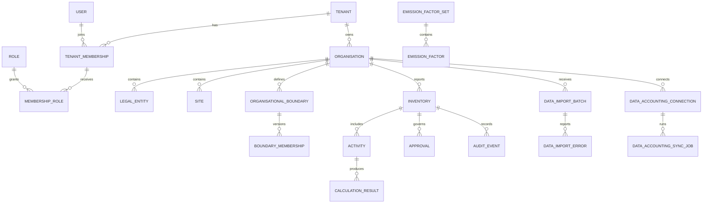

# Database schema and permissions

## Data principles

PostgreSQL is authoritative. UUID primary keys and timestamps are used broadly. Customer-owned rows carry `tenant_id`; service queries enforce tenant scope. Approved calculations, inventories and reports are immutable or superseded. Secrets are external references, not stored credentials. Alembic migrations are forward-reviewed and rehearsed in staging.

## Core relationship map

## Domain groups

### Identity
`users`, `tenant_memberships`, `roles`, `membership_roles`, `user_invitations`, `refresh_sessions`, MFA/recovery and security-event records. Email is globally normalised; membership is unique per tenant/user; role names are tenant-scoped.

### Organisation and inventory
Tenants, organisations, legal entities, sites, organisational boundaries, effective-dated memberships, reporting periods, inventories, base-year/recalculation governance and restatement history.

### Methodology and calculation
Methodology versions, emission-factor sets/factors, import jobs/errors, unit normalisation, activity versions, immutable calculation runs/results, factor-resolution lineage and warnings.

### Data integration
Organisation mappings; import batches/errors; vehicles, shipments, journeys, fuel, payload and operational-emission records; classification/review records; accounting connections and synchronisation jobs. External identifiers and idempotency identities are unique within tenant/provider boundaries.

### Audit and reporting
Audit events capture actor, action, entity and safe event data. Approval, locking, supersession, report hashes and export lineage must be retained according to the approved retention schedule.

## Permission matrix

| Capability | Contributor | Reviewer | Approver | Auditor | Tenant admin | Methodology manager | Platform admin |
|---|---:|---:|---:|---:|---:|---:|---:|
| Enter/import data | ✓ | ✓ |  | read | configurable |  | support |
| Confirm classifications |  | ✓ |  | read | configurable |  | support |
| Approve/lock inventory |  |  | ✓ | read | configurable |  | support |
| View audit/security | own scope | ✓ | ✓ | ✓ | ✓ | method scope | ✓ |
| Manage users/roles |  |  |  |  | ✓ |  | ✓ |
| Govern factors/methods |  |  |  | read |  | ✓ | ✓ |
| Manage tenants/operations |  |  |  | read |  |  | ✓ |

“Support” never implies unrestricted database access; impersonation or emergency access must be controlled and audited.

## Migration controls

Every schema change requires upgrade logic, constraint/index review, tenant-isolation review, rollback/recovery plan, test coverage and staging rehearsal. Destructive retention operations require approved policy and recoverable evidence.
